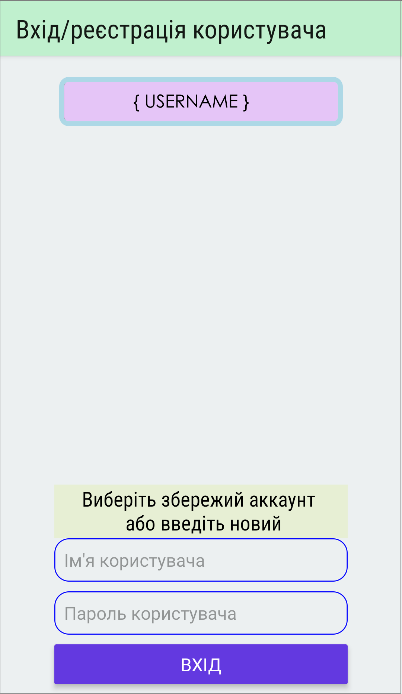

<h1 align="center">Сумиводоканал</h1>

  

**UA:**
Android-клієнт для відправки показників лічильника води в КП "Міськводоканал" Сумської міської ради.
В програмі використовуються наступні модулі npm:
  * react-navigation
  * react-native-swipe-list-view
  * react-native-sqlite-storage

**EN:**

Android client for sending water meter readings to KP "MiskVodokanal" of Sumy City Council.
The following modules of npm are used in the program:
  * react-navigation
  * react-native-swipe-list-view
  * react-native-sqlite-storage

<h2 align="center">Supporting Vodokanal</h2>

Vodokanal is an MIT licensed open source project, and the latest version will always be downloadable for free from the GitHub.

<h2>Screenshot</h2>

  

<h2>Download and Installation</h2>

